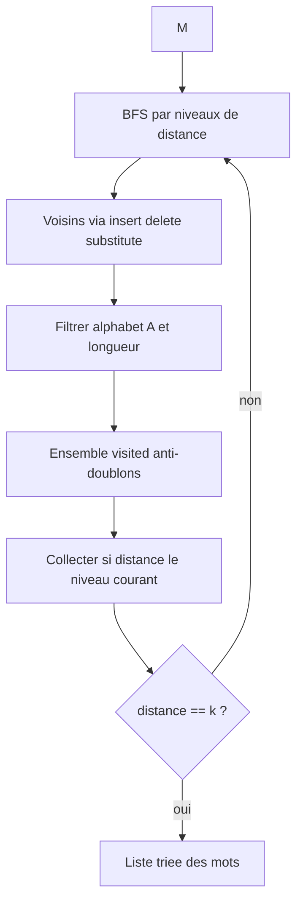
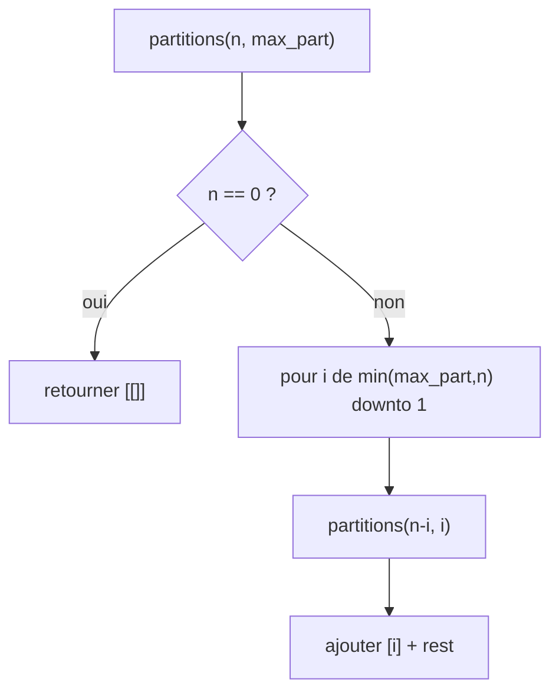

# Plan : Exercices Levenshtein et partitions

## Contexte

Le dossier [`programmation_par_contrainte`](c:\Users\Octane\Desktop\master-I\programmation_par_contrainte) est vide. Nous partons de zéro en **Python pur** (stdlib uniquement), avec **deux approches** pour l'exercice 1 et un **algorithme récursif** pour l'exercice 2.

## Structure proposée

```
programmation_par_contrainte/
├── alphabet.py              # A = alphabet malgache (partagé)
├── exercice1/
│   ├── levenshtein.py       # distance + utilitaires
│   ├── enum_bfs.py          # méthode principale (BFS)
│   └── enum_cp.py           # variante CP (backtracking + contraintes)
├── exercice2/
│   └── partitions.py        # énumération récursive
└── main.py                  # démos : vato/k=2 et n=4
```

---

## Exercice 1 — Mots à distance de Levenshtein ≤ k

### Alphabét malgache

```python
ALPHABET = "abdefghijklmnoprstvyz"  # 21 lettres, ordre fixe pour affichage
```

### 1a. Fonction de distance ([`exercice1/levenshtein.py`](c:\Users\Octane\Desktop\master-I\programmation_par_contrainte\exercice1\levenshtein.py))

Programmation dynamique classique sur une matrice `(len(M)+1) × (len(w)+1)` :

- `dp[i][j]` = distance entre `M[:i]` et `w[:j]`
- Transitions : suppression, insertion, substitution (coût 0 si caractères identiques)
- Complexité : `O(|M| · |w|)` par paire — utilisée pour **vérification** et pour la variante CP

### 1b. Méthode BFS — génération par opérations d'édition ([`exercice1/enum_bfs.py`](c:\Users\Octane\Desktop\master-I\programmation_par_contrainte\exercice1\enum_bfs.py))

**Idée :** partir du mot `M` et explorer le graphe des mots liés par **une** opération d'édition (insertion / suppression / substitution avec lettres de `A`).



**Algorithme :**

1. Initialiser `visited = {M}`, `current = {M}`, `all_words = {M}`
2. Pour `d` de 1 à `k` :
   - `next_level = ∅`
   - Pour chaque mot `w` dans `current`, générer tous les voisins :
     - **Suppression** : retirer un caractère à chaque position
     - **Insertion** : insérer chaque `c ∈ A` à chaque position (0 … len(w))
     - **Substitution** : remplacer chaque position par chaque `c ∈ A`, `c ≠ w[i]`
   - Ajouter à `next_level` les voisins non visités, filtrer `all(c in A for c in neighbor)`
   - `visited |= next_level`, `all_words |= next_level`, `current = next_level`
3. Retourner `sorted(all_words)` (option : regrouper par distance exacte)

**Bornes utiles :** longueur des candidats dans `[max(0, |M|−k), |M|+k]`.

**Complexité :** dépend fortement de `k` et de `|A|` ; pour `k` petit (ex. 2) et `|M|` modeste, c'est efficace et intuitif pour le rapport.

### 1c. Variante CP en backtracking pur ([`exercice1/enum_cp.py`](c:\Users\Octane\Desktop\master-I\programmation_par_contrainte\exercice1\enum_cp.py))

Modèle CP **sans bibliothèque externe**, exprimé comme recherche avec contraintes :

| Élément | Définition |
|---------|------------|
| Variables | `w[0..L−1]` avec `L ∈ [|M|−k, |M|+k]` |
| Domaines | chaque `w[i] ∈ A` |
| Contrainte | `levenshtein(M, w) ≤ k` |
| Stratégie | essayer chaque longueur `L`, remplir position par position (MRV simple : ordre fixe) |

**Élagage :** borne inférieure partielle via DP sur préfixe (optionnel mais recommandé) — si le préfixe courant rend impossible d'atteindre distance ≤ k, backtrack immédiatement.

**Rôle pédagogique :** illustre la programmation par contraintes (variables + domaines + contrainte globale + recherche) ; les deux méthodes doivent produire le **même ensemble** de mots pour validation croisée.

### Démo exercice 1

`main.py` exécutera :

```python
M, k = "vato", 2
# BFS + CP → afficher comptage et listes (vérifier égalité)
```

---

## Exercice 2 — Partitions d'un entier n ([`exercice2/partitions.py`](c:\Users\Octane\Desktop\master-I\programmation_par_contrainte\exercice2\partitions.py))

### Algorithme récursif (ordre non pris en compte)

Représentation **canonique non croissante** : chaque terme ≤ terme précédent → évite les doublons `3+1` / `1+3`.

```python
def partitions(n: int, max_part: int | None = None) -> list[list[int]]:
    if max_part is None or max_part > n:
        max_part = n
    if n == 0:
        return [[]]
    result = []
    for i in range(min(max_part, n), 0, -1):   # i = plus grand terme choisi
        for rest in partitions(n - i, i):         # reste avec parts ≤ i
            result.append([i] + rest)
    return result
```



**Exemple `n = 4` :** `[4]`, `[3,1]`, `[2,2]`, `[2,1,1]`, `[1,1,1,1]`.

**Fonctions auxiliaires :**

- `format_partition(p)` → `"3+1"` pour affichage
- Générateur `partitions_gen(n)` (yield) si on préfère économiser la mémoire — optionnel, même logique

---

## Fichier [`main.py`](c:\Users\Octane\Desktop\master-I\programmation_par_contrainte\main.py)

Point d'entrée unique :

1. **Exercice 1** : `M="vato"`, `k=2` — afficher nombre de mots, liste triée, comparaison BFS vs CP
2. **Exercice 2** : `n=4` puis `n` lu en argument CLI (`python main.py --n 6`) — afficher toutes les partitions formatées

---

## Validation manuelle

| Test | Attendu |
|------|---------|
| `levenshtein("chat","chats")` | 1 |
| `levenshtein("chat","chien")` | 3 |
| `partitions(4)` | 5 partitions listées ci-dessus |
| BFS vs CP sur `vato`, `k=2` | mêmes ensembles |
| Alphabet | rejeter tout mot contenant une lettre hors `A` |

Commande de vérification :

```bash
python main.py
python main.py --n 5
```

---

## Livrables pour le rapport de cours

Chaque module pourra être commenté en tête avec :

- **Exercice 1** : description de la méthode BFS (graphe d'édition) + modèle CP (variables, domaines, contrainte, recherche)
- **Exercice 2** : invariant récursif (`max_part` garantit l'unicité) + trace sur `n=4`

Aucune dépendance externe ; compatible Python 3.10+ (`int | None`).
